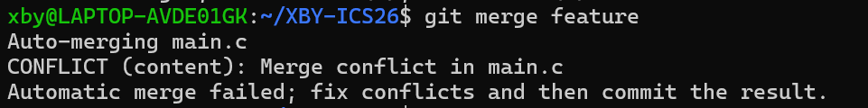
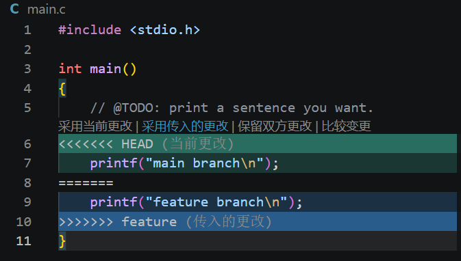
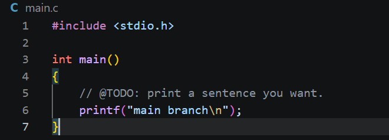

# ICS Lab0 实验报告

## 一、多人协作经历

我之前没有多人协同开发的经历。通过本次实验，我理解了 Git 的分支和合并机制如何支持多人协作：每个人可以在自己的分支上开发，最后通过 merge 合并到主分支。当两人修改了同一文件的同一位置时，Git 会提示冲突，需要手动解决。这比手动复制代码、保存多个 `_old` 备份文件要清晰和可靠得多。

## 二、Git 为什么要设计“暂存-提交”两个步骤？

Git 把“暂存（stage）”和“提交（commit）”分开，是为了让使用者能精确控制每次提交的内容：

1. **分批提交**：可能同时改了多个文件，但只想先提交其中一部分，就可以只 `git add` 那一部分。
2. **提交更干净**：每次 commit 对应一个完整、独立的小改动，方便回退和查看历史。
3. **方便审查**：在提交前可以先用 `git status` 和 `git diff` 检查暂存区内容，确认无误再提交。
4. **支持撤销**：如果发现暂存了不想要的改动，可以用 `git restore` 取消暂存，而不用撤销工作区的修改。

所以“暂存-提交”两步让版本历史更清晰、更可控。

## 三、git branch 和 git branch -a 的区别

- `git branch`：只列出**本地分支**。
- `git branch -a`：列出**本地分支和远程跟踪分支**，例如 `remotes/origin/main`。

在本次实验中，刚创建 `dev` 分支时两者输出看起来一样，是因为当时还没有拉取远程分支的信息。一旦本地仓库与远程仓库同步，`git branch -a` 就会多出 `remotes/origin/...` 这些远程分支。

## 四、三篇网页任选其二，概括并谈“为什么要学习 Git”

### 选读 1：Commit Message 规范

**内容概括：**

这篇文章介绍了 Git 提交信息（Commit message）的编写规范。文章指出，Commit message 应该清晰明了地说明本次提交的目的，而不是随便写一句“修改”或“更新”。目前社区最广泛使用的是 Angular 规范，它把 Commit message 分为三部分：

- **Header（必需）**：格式为 `<type>(<scope>): <subject>`，其中 type 表示提交类别，scope 表示影响范围，subject 是简短描述。
- **Body（可选）**：详细描述本次修改的动机、内容和与之前行为的对比。
- **Footer（可选）**：用于标注不兼容变动（BREAKING CHANGE）或关闭 Issue。

其中 type 只允许使用七种标识：feat（新功能）、fix（修补 bug）、docs（文档）、style（格式）、refactor（重构）、test（测试）、chore（构建或辅助工具变动）。每行不超过 72 个字符。

文章还介绍了配套工具：Commitizen 用于辅助生成符合规范的 Commit message，validate-commit-msg 用于检查格式，conventional-changelog 可以根据规范化的 commit 自动生成 Change log。

**我的理解：**

Commit message 规范看起来是小事，但对团队协作和项目维护非常重要。格式化的提交信息可以让 `git log` 一眼看出每次提交的目的，也方便按类型过滤 commit、自动生成发布说明。以前我写 commit 可能就写“修改”两个字，现在知道应该写成 `fix: 修复登录页面跳转错误` 这种形式，既规范又清晰。

这也让我理解到，Git 不只是“保存代码”的工具，它同时也在记录项目的演进历史。好的提交信息本身就是一份项目文档，对未来的自己和其他协作者都有帮助。

### 选读 2：Git Flow 分支控制

**内容概括：**

这篇文章介绍了 Gitflow 分支管理规范。它的核心思想是让不同分支各司其职，避免多人协作时出现代码冲突和版本混乱。Gitflow 主要包含五类分支：

- **master**：永久分支，与线上环境运行代码一致，只用于存放发布版本，每次新 commit 后立即打 tag。
- **develop**：永久分支，从 master 分离出来，是开发阶段的公共分支，所有功能开发完成后合并到这里。
- **feature**：临时分支，每个新功能单独开一个，从 develop 创建，开发完成后合并回 develop 并删除。
- **release**：临时分支，用于测试阶段修复 bug，从 develop 创建，完成后合并到 master 和 develop 并删除。
- **hotfix**：临时分支，用于紧急修复线上 bug，从 master 创建，修复后合并到 master 和 develop 并删除。

文章还给出了使用 Git 命令和 git-flow 扩展库两种操作示例，并说明了版本号的含义：格式为 `0.0.0`，首位是重大版本，中间是功能迭代版本，末位是热修复版本。master 分支上的 tag 只使用数字和点。

**我的理解：**

Gitflow 的核心原则是“从哪里来，最后回到哪里去”。它把开发、测试、发布、紧急修复这些不同阶段的工作隔离开，让每个分支职责明确。这样多人协作时，大家不会都往同一个分支上乱推代码，减少冲突，也保证线上版本的稳定性。

我觉得 Gitflow 对大型项目尤其重要，因为一个功能可能开发很久，不能直接在主分支上改。通过 feature 分支，每个人可以在自己的分支上开发，确认没问题后再合并。release 和 hotfix 分支则分别应对测试阶段和线上紧急情况，思路非常清晰。

### 为什么要学习 Git

通过阅读这两篇文章，我对“为什么要学习 Git”有了更具体的理解：

1. **版本回溯**：Git 记录了每一次提交，可以随时回到过去的任意版本。不像手动保存 `_old` 文件那样混乱，Git 用 commit 历史清晰地管理每次修改。
2. **多人协作**：Git 的分支和合并机制让多人可以同时开发不同功能，最后通过 merge 整合。出现冲突时也有明确的解决流程，而不是靠手动复制代码。
3. **工程规范**：Commit message 规范和 Gitflow 分支规范让项目历史清晰可读。好的提交信息本身就是项目文档，方便未来的自己和他人理解代码演进。
4. **自动化基础**：规范化的 commit 可以自动生成 Change log，配合 CI/CD 流程，能大大提高发布效率。
5. **开源贡献**：GitHub 上的开源项目都使用 Git 协作。学会 Git 才能参与开源、阅读他人代码、提交 pull request。

总之，Git 不只是一个“保存代码”的工具，它是现代软件工程协作的基础设施。学好 Git，对课程实验、以后的工作和参与开源都有很大帮助。

## 五、实验步骤

1. 在 WSL 中配置 Git 用户名和邮箱
2. 使用 `ssh-keygen` 生成 Ed25519 密钥对，并将公钥添加到 GitHub 的 SSH keys 中。
3. 在 GitHub 上用课程模板仓库创建个人仓库 `XBY-ICS26`。
4. 在 WSL 中执行 `git clone git@github.com:Xby1874/XBY-ICS26.git` 克隆到本地。
5. 修改 `main.c` 中的 TODO 部分，将其改为 `printf("Xby1874\n");`。
6. 执行 `git add main.c`、`git commit`、`git push` 提交并推送到 GitHub。
7. 新建并切换到 `feature` 分支：`git switch -c feature`。
8. 在 `feature` 分支上修改 `main.c` 的同一行，提交。
9. 切回 `main` 分支，再次修改 `main.c` 的同一行，提交。
10. 执行 `git merge feature`，出现合并冲突。
11. 在 VS Code 中手动解决冲突，删掉冲突标记，保留最终内容。
12. 执行 `git add main.c` 和 `git commit` 完成合并，并 `git push`。

## 六、冲突截图

### 1. git merge 出现冲突

### 2. VS Code 中的冲突标记

### 3. 解决冲突后的 main.c

